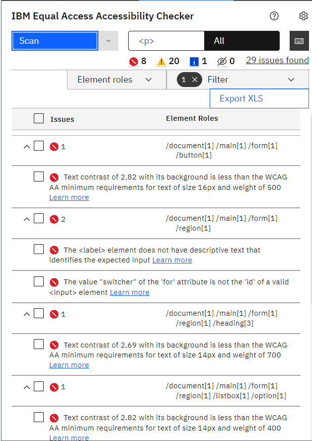
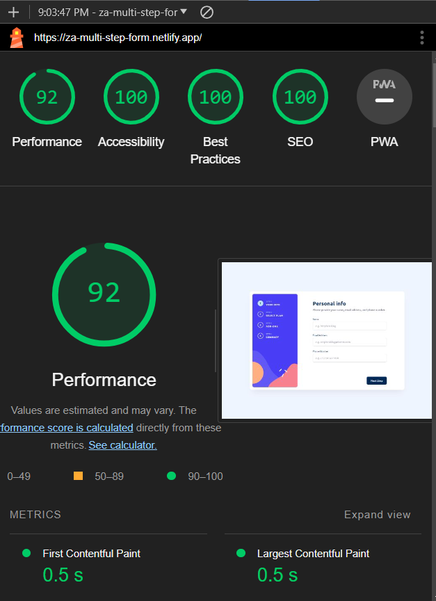

# Frontend Mentor - Multi-step form

This is a solution to the [Multi-step form challenge on Frontend Mentor](https://www.frontendmentor.io/challenges/multistep-form-YVAnSdqQBJ). Frontend Mentor challenges help you improve your coding skills by building realistic projects.

## Overview

### Figma Design

<p align="center">

</p>

### Outcome

<p align="center">

</p>

## Technologies

The technologies used in this project are:

* HTML & Tailwind & TypeScript
* Angular (animation, reactive forms)
* Unit testing (Jasmine)

## Features

* **Responsive Design**: Ensures the form looks great on all devices.
* **Form Validation**: Real-time validation with meaningful error messages.
* **Accessibility**: Built with accessibility in mind.
* **Animations**: Smooth animations for form interactions.
* **Unit testing**: Comprehensive unit tests to ensure code reliability.
* **Identical Design**: Almost identical to figma design except what has to reconsider for accessibility.

## Setup

To run this app in development mode open the terminal and write the following:

```shell  
git clone https://github.com/Zakaria9375/fm-multi-step-form.git 
cd fm-contact-form  
npm install 
 
# you need to install angular cli to run this app in development mode
npm install -g @angular/cli

ng serve
```

## Links

* [Challenge Page](https://www.frontendmentor.io/challenges/multistep-form-YVAnSdqQBJ)
* [Live Demo](https://za-multi-step-form.netlify.app/)

## Testing

### Accessibility

This app has been crafted with a focus on accessibility, utilizing the Accessibility Linter, IBM Equal Access Accessibility Checker extension, and WCAG extension to adhere to accessibility best practices. Key features include:

* Zooming: Maintains content and functionality without loss when zooming.
* Keyboard-only navigation: All interactive elements are fully accessible, focusable, and clickable via keyboard.
* Static code analysis: Ensures no errors through the use of semantic HTML.
* Aria rules compliance: Proper implementation of ARIA (Accessible Rich Internet Applications) rules.
* Semantic HTML: Employs clean, semantic HTML when ever possible for better accessibility.

<p align="center">

</p>

<p align="center">

</p>

### Unit Testing

This project uses Jasmine and karma for unit testing

<p align="center">

</p>

To run and execute all the unit tests defined in the project after setting the app in development mode, open a new terminal and write the following:

```shell
ng test
```

### Lighthouse report

<p align="center">

</p>


## About the Author

* Portfolio - [Zakaria Ali](https://zaportfolio.netlify.app/)
* Frontend Mentor Profile - [@Zakaria9375](https://www.frontendmentor.io/profile/Zakaria9375)
* Project by - [Frontend Mentor team](https://www.frontendmentor.io/)

## Contributing

**Want to contribute?** *Great!* Here’s how you can help:

1. Fork the repo and create your branch from `main`.
2. Make your changes and test.
3. Issue that "pull" request!

## License

Copyright (c) 2024-present, Zakaria Ali
